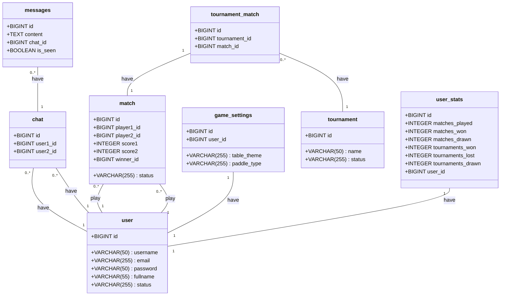

```mermaid
classDiagram
    class chat {
        +BIGINT id
        +BIGINT user1_id
        +BIGINT user2_id
    }

    class messages {
        +BIGINT id
        +TEXT content
        +BIGINT chat_id
        +BOOLEAN is_seen
    }

    class match {
        +BIGINT id
        +BIGINT player1_id
        +BIGINT player2_id
        +INTEGER score1
        +INTEGER score2
        +BIGINT winner_id
        +VARCHAR(255) status
    }

    class game_settings {
        +BIGINT id
        +VARCHAR(255) table_theme
        +VARCHAR(255) paddle_type
        +BIGINT user_id
    }

    class tournament {
        +BIGINT id
        +VARCHAR(50) name
        +VARCHAR(255) status
    }

    class user {
        +BIGINT id
        +VARCHAR(50) username
        +VARCHAR(255) email
        +VARCHAR(50) password
        +VARCHAR(55) fullname
        +VARCHAR(255) status
    }

    class user_stats {
        +BIGINT id
        +INTEGER matches_played
        +INTEGER matches_won
        +INTEGER matches_drawn
        +INTEGER tournaments_won
        +INTEGER tournaments_lost
        +INTEGER tournaments_drawn
        +BIGINT user_id
    }

    class tournament_match {
        +BIGINT id
        +BIGINT tournament_id
        +BIGINT match_id
    }

    chat "0..*" -- "1" user : have
    chat "0..*" -- "1" user : have
    messages "0..*" -- "1" chat : have
    match "0..*" -- "1" user : play
    match "0..*" -- "1" user : play
    game_settings "1" -- "1" user : have
    tournament_match "0..*" -- "1" tournament : have
    tournament_match "1" -- "1" match : have
    user_stats "1" -- "1" user : have
```